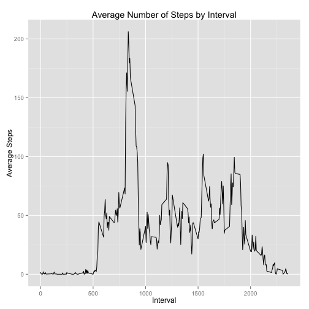

# Reproducible Research: Peer Assessment 1

## Setup
Load necessary packages:

```r
library(ggplot2)
```

## Loading and preprocessing the data

Load ggplot2 and unzip the contents of `activity.zip`:

```r
unzip("activity.zip")
```

Read the contents of `activity.csv` into a data frame and convert `date` to 
Date class:

```r
activity <- read.csv("activity.csv")
activity$date <- as.Date(activity$date)
```

## What is mean total number of steps taken per day?

Create a summary data frame for number of steps by date:

```r
stepsByDate <- with(activity, aggregate(steps, list(date), sum, na.rm = TRUE))
names(stepsByDate) <- c("date", "steps")
```

1. Make a histogram of the total number of steps taken each day:

```r
totalStepsPlot <- ggplot(stepsByDate, aes(date, steps)) + 
                    geom_bar(stat = "identity") +
                    theme(axis.text.x = element_text(angle = 45, hjust = 1)) +
                    labs(title = "Total Steps per Day",
                         x = "Date",
                         y = "Total Steps")
```

 

2. Calculate and report the **mean** and **median** total number of steps taken 
per day:

**MEAN:**

```r
mean(stepsByDate$steps)
```

```
## [1] 9354
```

**MEDIAN:**

```r
median(stepsByDate$steps)
```

```
## [1] 10395
```

## What is the average daily activity pattern?

Create a data frame that averages the number of steps across days by interval:

```r
avgStepsByInterval <- with(activity, 
                           aggregate(steps,list(interval), mean, na.rm = TRUE))
names(avgStepsByInterval) <- c("interval", "avg_steps")
```


1. Make a time series plot of the 5-minute interval (x-axis) and the average 
number of steps taken, averaged across all days (y-axis):

```r
qplot(data = avgStepsByInterval, interval, avg_steps, geom = "line") +
             labs(title = "Average Number of Steps by Interval",
                  x = "Interval",
                  y = "Average Steps")
```

 

2. Which 5-minute interval, on average across all the days in the dataset, 
contains the maximum number of steps?  

```r
with(avgStepsByInterval, interval[which.max(avg_steps)])
```

```
## [1] 835
```

## Imputing missing values
1. Calculate and report the total number of missing values in the dataset (i.e. 
the total number of rows with `NA`s):

```r
sum(is.na(activity))     # note that only steps column contains NAs
```

```
## [1] 2304
```

2. Devise a strategy for filling in all of the missing values in the dataset. 
The strategy does not need to be sophisticated. For example, you could use the 
mean/median for that day, or the mean for that 5-minute interval, etc.

*Strategy is to replace `NA`s with average values for corresponding 
intervals as identified in `avgStepsByInterval`.*

3. Create a new dataset that is equal to the original dataset but with the 
missing data filled in:

```r
activityImputed <- activity

activityImputed$steps[which(is.na(activityImputed$steps))] <- 
     avgStepsByInterval$avg_steps[match(activityImputed$interval[which(
          is.na(activityImputed$steps))], avgStepsByInterval$interval)]
```

4. Make a histogram of the total number of steps taken each day and Calculate 
and report the **mean** and **median** total number of steps taken per day:

Create a summary data frame for number of steps by date:

```r
stepsByDateImputed <- with(activityImputed, aggregate(steps, list(date), sum, na.rm = TRUE))
names(stepsByDateImputed) <- c("date", "steps")
```

Plot:

```r
ggplot(stepsByDateImputed, aes(date, steps)) + 
     geom_bar(stat = "identity") +
     theme(axis.text.x = element_text(angle = 45, hjust = 1)) +
     labs(title = "Total Steps per Day",
          x = "Date",
          y = "Total Steps")
```

 

Do these values differ from the estimates from the first part of the assignment? 

*Yes.*

What is the impact of imputing missing data on the estimates of the total daily 
number of steps?

*Several days that previously had no data now contain data.*

## Are there differences in activity patterns between weekdays and weekends?

1. Create a new factor variable (`dayType`) in the dataset with two levels -- 
"weekday" and "weekend" indicating whether a given date is a weekday or weekend
day:

```r
activityImputed$dayType <- NA      # initialize dayType column

weekdays <- c("Monday", "Tuesday", "Wednesday", "Thursday", "Friday")
weekends <- c("Saturday", "Sunday")

# populate dayType with "weekday" or "weekend"
activityImputed$dayType[which(weekdays(activityImputed$date) %in% weekdays)] <- "weekday"
activityImputed$dayType[which(weekdays(activityImputed$date) %in% weekends)] <- "weekend"

# convert to factor for use with facet_grid
activityImputed$dayType <- as.factor(activityImputed$dayType)
```

2. Make a panel plot containing a time series plot of the 5-minute interval (x-axis) and the average number of steps taken, averaged across all weekday days or weekend days (y-axis):

First create new data frame with average steps by `interval` and `dayType`:

```r
avgStepsIntervalDayType <- with(activityImputed, 
                                aggregate(steps, list(interval, dayType), 
                                          mean))
names(avgStepsIntervalDayType) <- c("interval", "day_type", "avg_steps")
```

Next create plot using `avgStepsIntervalDayType`:

```r
qplot(data = avgStepsIntervalDayType, interval, avg_steps, geom = "line") +
     labs(title = "Average Number of Steps by Interval and Day Type", 
          x = "Interval",
          y = "Average Steps") +
     facet_grid(day_type ~ .)
```

 
